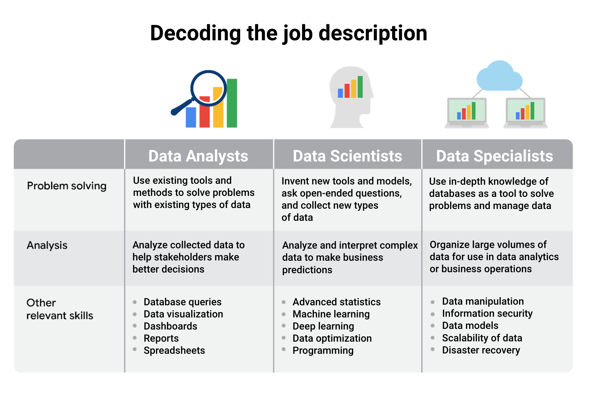

# Course 01 - Foundations: data, data everywhere

# Module 1: 

## Data analysis
The collection, transformation, and organization of data in order to draw conclusions, make predictions, and drive informed decision-making.

## Data analyst
Someone who collects, transforms, and organizes data in order to help make informed decisions.

# The six steps of the data analysis process
## Ask (understand the question to be  answered)
In the ask phase, you’ll work to understand the challenge to be solved or the question to be  answered. It will likely be assigned to you by stakeholders. As this is the ask phase, you’ll ask many questions to help you along the way. 
## Prepare (find and collect data. Gather data and verify that it is accurate and useful)
Next, in the prepare phase, you’ll find and collect the data you'll need to answer your questions. You’ll identify data sources, gather data, and verify that it is accurate and useful for answering your questions. 
## Process (clean and organize data. Remove inconsistencies)
The process phase is when you will clean and organize your data. Tasks you perform here include removing any inconsistencies; filling in missing values; and, in many cases, changing the data to a format that's easier to work with. Essentially, you’re ensuring the data is ready before you begin analysis.
## Analyze (data analysis to uncover answers and solutions. Examine trends and patterns)
The analyze phase is when you do the necessary data analysis to uncover answers and solutions. Depending on the situation and the data, this could involve tasks such as calculating averages or counting items in categories so you can examine trends and patterns.
## Share (present findings through a report, presentation, or data visualizations)
Next comes the share phase, when you present your findings to decision-makers through a report, presentation, or data visualizations. As part of the share phase, you decide which medium you want to use to share your findings and select the data to include. Tools for presenting data visually include charts made in Google Sheets, Tableau, and R. 
## Act (put the data insights into action)
Last is the act phase, in which you and others in the company put the data insights into action. This could mean implementing a new business strategy, making changes to a website, or any other action that solves the initial problem. 

# Example 1
An organization was experiencing a high turnover rate among new hires. Many employees left the company before the end of their first year on the job. The analysts used the data analysis process to answer the following question: How can the organization improve the retention rate for new employees? 

## Ask
First up, the analysts needed to define what the project would look like and what would qualify as a successful result. So, to determine these things, they asked effective questions and collaborated with leaders and managers who were interested in the outcome of their people analysis. These were the kinds of questions they asked:
- What do you think new employees need to learn to be successful in their first year on the job? 
- Have you gathered data from new employees before? If so, may we have access to the historical data?
- Do you believe managers with higher retention rates offer new employees something extra or unique?
- What do you suspect is a leading cause of dissatisfaction among new employees?
- By what percentage would you like employee retention to increase in the next fiscal year?
## Prepare
It all started with solid preparation. The group built a timeline of three months and decided how they wanted to relay their progress to interested parties. Also during this step, the analysts identified what data they needed to achieve the successful result they identified in the previous step - in this case, the analysts chose to gather the data from an online survey of new employees. These were the things they did to prepare:

- They developed specific questions to ask about employee satisfaction with different business processes, such as hiring and onboarding, and their overall compensation. 

- They established rules for who would have access to the data collected - in this case, anyone outside the group wouldn't have access to the raw data, but could view summarized or aggregated data. For example, an individual's compensation wouldn't be available, but salary ranges for groups of individuals would be viewable. 

- They finalized what specific information would be gathered, and how best to present the data visually. The analysts brainstormed possible project- and data-related issues and how to avoid them. 
## Process
The group sent the survey out. Great analysts know how to respect both their data and the people who provide it. Since employees provided the data, it was important to make sure all employees gave their consent to participate. The data analysts also made sure employees understood how their data would be collected, stored, managed, and protected. Collecting and using data ethically is one of the responsibilities of data analysts. In order to maintain confidentiality and protect and store the data effectively, these were the steps they took:

- They restricted access to the data to a limited number of analysts. 

- They cleaned the data to make sure it was complete, correct, and relevant. Certain data was aggregated and summarized without revealing individual responses. 

- They uploaded raw data to an internal data warehouse for an additional layer of security. 
## Analyze
Then, the analysts did what they do best: analyze! From the completed surveys, the data analysts discovered that an employee’s experience with certain processes was a key indicator of overall job satisfaction. These were their findings:

- Employees who experienced a long and complicated hiring process were most likely to leave the company. 

- Employees who experienced an efficient and transparent evaluation and feedback process were most likely to remain with the company. 

The group knew it was important to document exactly what they found in the analysis, no matter what the results. To do otherwise would diminish trust in the survey process and reduce their ability to collect truthful data from employees in the future. 
## Share
Just as they made sure the data was carefully protected, the analysts were also careful sharing the report. This is how they shared their findings:

- They shared the report with managers who met or exceeded the minimum number of direct reports with submitted responses to the survey. 

- They presented the results to the managers to make sure they had the full picture. 

- They asked the managers to personally deliver the results to their teams. 

This process gave managers an opportunity to communicate the results with the right context. As a result, they could have productive team conversations about next steps to improve employee engagement. 
## Act
The last stage of the process for the team of analysts was to work with leaders within their company and decide how best to implement changes and take actions based on the findings. These were their recommendations: 

- Standardize the hiring and evaluation process for employees based on the most efficient and transparent practices. 

- Conduct the same survey annually and compare results with those from the previous year. 

A year later, the same survey was distributed to employees. Analysts anticipated that a comparison between the two sets of results would indicate that the action plan worked. Turns out, the changes improved the retention rate for new employees and the actions taken by leaders were successful! 

# Example 2 - The retirement contribution dilemma
The management team at a fictional midsized tech company, Geo-Flow, Inc., noticed that employee participation in the company’s retirement contribution program was lower than expected. The company had invested a lot of resources in establishing its world-class benefit program, with the goal of reducing employee turnover. Because so few employees were using the program, leaders wondered if they should develop educational training to explain the benefits to employees. They wanted to make a well-informed decision before committing to the investment, so they asked their data analytics department to make a recommendation. 

The analysts used the six phases framework and began by defining the problem. They<strong>asked</strong>, “Are employees investing in the company's retirement contribution program?”And, if not, “Should we create an educational program to encourage participation?” Satisfied with their research questions, they <strong>prepared</strong> their analysis project by gathering data from HR, such as employee demographics, salary levels, and current retirement contributions.

Next, they <strong>processed</strong> the data by cleaning and organizing it. They removed duplicates and data from individuals who had retired or left the company, then sorted the data by the employees’ ages, departments, and length of employment. Their <strong>analysis</strong> showed that some employee groups were less likely to contribute to the plan or to be aware that the company offers a matching contribution. They interpreted these results to mean that these employee groups were not receiving enough education on the company’s retirement contribution matching program. They also studied the data to find trends and insights and used data visualization to review their analysis by exploring it in different contexts.

The analysts <strong>shared</strong> their findings with the management team using visualizations including bar and pie charts that illustrated the facts clearly so decision-makers could easily interpret the data. The report showed that, while overall participation was decent, some employee groups were not taking full advantage of the retirement program—but they might, if they knew more about the program and the matching contribution the company offers. 

Based on these findings, the company took <strong>action</strong>, creating a targeted educational program focusing on the benefits of retirement contributions, specifically aimed at the employee groups identified as low contributors. Results showed that a few months after implementing this training, there was a significant increase in retirement contributions among the targeted groups.

## Insight from Cassie, Lead Decision Intelligence for Google Cloud
The advice that I give folks who are entering the space is to pick their specialization based on which flavor, which type of impact best suits their personality. Now, data science, the discipline of making data useful, is an umbrella term that encompasses three disciplines: machine learning, statistics, and analytics. These are separated by how many decisions you know you want to make before you begin with them. 

If you want to make a few important decisions under uncertainty, that is statistics. 

If you want to automate, in other words, make many, many, many decisions under uncertainty, that is machine learning and AI.

But what if you don't know how many decisions you want to make before you begin? What if what you're looking for is inspiration? You want to encounter your unknown unknowns. You want to understand your world. That is analytics.

When you're considering data science and you're choosing which area to specialize in, I recommend going with your personality. Which of the three excellences in data science feels like a better fit for you?

The excellence of statistics is rigor. Statisticians are essentially philosophers, epistemologists. They are very, very careful about protecting decision-makers from coming to the wrong conclusion. If that care and rigor is what you are passionate about, I would recommend statistics.

Performance is the excellence of the machine learning and AI engineer. You know that's the one for you if someone says to you, "I bet that you couldn't build an automation system that performs this task with 99.99999 percent accuracy," and your response to that is, "Watch me."

How about analytics? The excellence of an analyst is speed. How quickly can you surf through vast amounts of data to explore it and discover the gems, the beautiful potential insights that are worth knowing about and bringing to your decision-makers? Are you excited by the ambiguity of exploration? Are you excited by the idea of working on a lot of different things, looking at a lot of different data sources, and thinking through vast amounts of information, while promising not to snooze past the important potential insights? Are you okay being told, "Here is a whole lot of data. No one has looked at it before. Go find something interesting"? Do you thrive on creative, open-ended projects? If that's you, then analytics is probably the best fit for you.

A piece of advice that I have for analysts getting started on this journey is it can be pretty scary to explore the unknown. But I suggest letting go a little bit of any temptations towards perfectionism and instead, enjoying the fun, the thrill of exploration. Don't worry about right answers. See how quickly you can unwrap this gift and find out if there is anything fun in there. It's like your birthday, unwrapping a bunch of things. Some of them you like. Some of them you won't. But isn't it fun to know what's actually in there?

# Origins of the data analysis process
It is time to enter the data analysis process—how industry professionals move from data to decision. All team members can drive success by planning work both upfront and at the end of the data analysis process. While the data analysis process is well known among experts, there isn't a single defined structure or single architecture that’s uniformly followed by every data analyst. But there are some shared fundamentals.

The process presented as part of the Google Data Analytics Certificate is one that will be valuable to you as you keep moving forward in your career:

1. Ask: business challenge, objective, or question
2. Prepare: data generation, collection, storage, and data management
3. Process: data cleaning and data integrity
4. Analyze: data exploration, visualization, and analysis
5. Share: communicating and interpreting results 
6. Act:  putting  insights to work to solve the problem

Understanding this process—and all of the iterations that helped make it popular—will be a big part of guiding your own analysis and your work in this program. Let’s go over a few other variations of the data analysis process.

## EMC's data analysis process
EMC Corporation's (Dell EMC) data analytics process is cyclical with six steps:

1. Discovery
2. Pre-processing data
3. Model planning
4. Model building
5. Communicate results
6. Operationalize

This model, created by David Dietrich, reflects the cyclical nature of typical business projects. The phases aren’t static milestones; each step connects and leads to the next, and eventually repeats. Key questions help analysts test whether they have accomplished enough to move forward and ensure that teams have spent enough time on each of the phases and don’t start modeling before the data is ready. It is a little different from the data analysis process on which this program is based on, but it has some core ideas in common: the first phase is interested in discovering and asking questions; data has to be prepared before it can be analyzed and used; and then findings should be shared and acted on.

## SAS's iterative process
An iterative data analysis process was created by a company called SAS, a leading data analytics solutions provider. It can be used to produce repeatable, reliable, and predictive results: 
1. Ask
2. Prepare
3. Explore
4. Model
5. Implement
6. Act
7. Evaluate

The SAS model emphasizes the cyclical nature of their model by visualizing it as an infinity symbol. Its process has seven steps, many of which mirror the other models, like ask, prepare, model, and act. But this process is also a little different; it includes a step after the act phase designed to help analysts evaluate their solutions and potentially return to the ask phase again. 

## Project-based data analytics process 
A project-based data analytics process has five simple steps:

1. Identifying the problem
2. Designing data requirements
3. Pre-processing data
4. Performing data analysis
5. Visualizing data

This data analytics project process was developed by Vignesh Prajapati. It doesn’t include the sixth phase, or the act phase. However, it still covers a lot of the same steps described. It begins with identifying the problem, preparing and processing data before analysis, and ends with data visualization.

## Big data analytics process
Authors Thomas Erl, Wajid Khattak, and Paul Buhler proposed a big data analytics process in their book, Big Data Fundamentals: Concepts, Drivers & Techniques. Their process suggests phases divided into nine steps:

1. Business case evaluation
2. Data identification
3. Data acquisition and filtering
4. Data extraction
5. Data validation and cleaning 
6. Data aggregation and representation
7. Data analysis
8. Data visualization
9. Utilization of analysis results

This process appears to have three or four more steps than the previous models. But in reality, they have just broken down what has been referred to as prepare and process into smaller steps. It emphasizes the individual tasks required for gathering, preparing, and cleaning data before the analysis phase.

# Common misconceptions

## Difference between data scientists and data analysts.
It's easy to confuse the two, but what they do is actually very different. 

Data science is defined as creating new ways of modeling and understanding the unknown by using raw data. Here's a good way to think about it. Data scientists create new questions using data, while analysts find answers to existing questions by creating insights from data sources. 

## Difference between data analysis and data analytics
Data analysis and data analytics sound the same, but they're actually very different things. Let's start with analysis. 

You've already learned that data analysis is the collection, transformation, and organization of data in order to draw conclusions, make predictions, and drive informed decision-making. Data analytics in the simplest terms is the science of data. It's a very broad concept that encompasses everything from the job of managing and using data to the tools and methods that data workers use each and every day. So when you think about data, data analysis and the data ecosystem, it's important to understand that all of these things fit under the data analytics umbrella.

# Key data analyst skills

Analytical skills are qualities and characteristics associated with solving problems using facts. There are a lot of aspects to analytical skills, but, we'll focus on five essential points. 

## Curiosity 
Curiosity is all about wanting to learn something. Curious people usually seek out new challenges and experiences. This leads to knowledge. The very fact that you're here with me right now demonstrates that you have curiosity.
## Understanding context 
Now think about understanding context. Context is the condition in which something exists or happens. This can be a structure or an environment. A simple way of understanding context is by counting to 5. One, two, three, four, five. All of those numbers exist in the context of one through five. But what if a friend of yours said to you, one, two, four, five, three? Well, the three will be out of context. Simple, right? But it can be a little tricky. There's a good chance that you might not even notice the three being out of context if you aren't paying close attention. That's why listening and trying to understand the full picture is critical. In your own life, you put things into context all the time. For example, let's think about your grocery list. If you group together items like flour, sugar, and yeast, that's you adding context to your groceries. This saves you time when you're at the baking aisle at the grocery store. Let's look at another example. Have you ever shuffled a deck of cards and noticed the joker? If you're playing a game that doesn't include jokers, identifying that card means you understand it's out of context. Remove it, and you're much more likely to play a successful game. Now we know you have both curiosity and the ability to understand context.
## Having technical mindset
Let's move on to the third skill, a technical mindset. A technical mindset involves the ability to break things down into smaller steps or pieces and work with them in an orderly and logical way. For instance, when paying your bills, you probably already break down the process into smaller steps. Maybe you start by sorting them by the date they're due. Next, you might add them up and compare that amount to the balance in your bank account. This would help you see if you can pay your bills now, or if you should wait until the next paycheck. Finally, you'd pay them. When you take something that seems like a single task, like paying your bills, and break it into smaller steps with an orderly process, that's using a technical mindset.
## Data design
Now let's explore the fourth part of an analytical skill set, data design. Data design is how you organize information. As a data analyst, design typically has to do with an actual database. But, again, the same skills can easily be applied to everyday life. For example, think about the way you organize the contacts in your phone. That's actually a type of data design. Maybe you list them by first name instead of last, or maybe you use email addresses instead of their names. What you're really doing is designing a clear, logical list that lets you call or text a contact in a quick and simple way.
## Data strategy
The last, but definitely not least, the fifth and final element of analytical skills is data strategy. Data strategy is the management of the people, processes, and tools used in data analysis. Let's break that down. You manage people by making sure they know how to use the right data to find solutions to the problem you're working on. For processes, it's about making sure the path to that solution is clear and accessible. For tools, you make sure the right technology is being used for the job. Now, you may be doubting my ability to give you an example from real life that demonstrates data strategy. But check this out. Imagine mowing a lawn. Step 1 would be reading the owner's manual for the mower. That's making sure the people involved, or you, in this example, know how to use the data available. The manual would instruct you to put on protective eyewear and closed-toe shoes. Then, it's on to step 2: making the process, the path, clear and accessible. This will involve you walking around the lawn, picking up large sticks or rocks that might get in your way. Finally, for step 3, you check the lawn mower, your tool, to make sure it has enough gas and oil, and is in working condition, so the lawn can be mowed safely. There you have it. Now you know the five essential skills of a data analyst. Curiosity, understanding context, having a technical mindset, data design, and data strategy. I told you that you are already an analytical thinker. Now, you can start actively practicing these skills as you move through the rest of this course. Curious about what's next? Move on to the next video.

# Analytical thinking
Identifying and defining a problem and then solving it by using data in an organized, step-by-step mnanner.
## The five key aspects to analytical thinking
### Visualization
The graphical representation of information. Examples: graphs, maps, etc. Visuals can help data analysts understand and display information more effectively.
### Strategy
With so much data available, having a strategic mindset is key to staying focused and on track. Strategizing helps data analysts see what they want to achieve with the data and how they can get there. Strategy also helps improve the quality and usefulness of the data we collect. By strategizing, we know all our data is valuable and can help us accomplish our goals.
 
### Problem-orientation
Data analysts use a problem-oriented approach in order to identify, describe, and solve problems. It's all about keeping the problem top of mind throughout the entire project. For example, say a data analyst is told about the problem of a warehouse constantly running out of supplies. They would move forward with different strategies and processes. But the number one goal would always be solving the problem of keeping inventory on the shelves. Data analysts also ask a lot of questions. This helps improve communication and saves time while working on a solution. An example of that would be surveying customers about their experiences using a product and building insights from those questions to improve their product. 

### Correlation
Being able to identify a correlation between two or more pieces of data. A correlation is like a relationship. You can find all kinds of correlations in data. Maybe it's the relationship between the length of your hair and the amount of shampoo you need. Or maybe you notice a correlation between a rainier season leading to a high number of umbrellas being sold. But as you start identifying correlations in data, there's one thing you always want to keep in mind: Correlation does not equal causation. In other words, just because two pieces of data are both trending in the same direction, that doesn't necessarily mean they are all related. 

### Big-picture and detail-oriented thinking
This means being able to see the big picture as well as the details. A jigsaw puzzle is a great way to think about this. Big-picture thinking is like looking at a complete puzzle. You can enjoy the whole picture without getting stuck on every tiny piece that went into making it. If you only focus on individual pieces, you wouldn't be able to see past that, which is why big-picture thinking is so important. It helps you zoom out and see possibilities and opportunities. This leads to exciting new ideas or innovations. On the flip side, detail-oriented thinking is all about figuring out all of the aspects that will help you execute a plan. In other words, the pieces that make up your puzzle. There are all kinds of problems in the business world that can benefit from employees who have both a big-picture and a detail-oriented way of thinking. Most of us are naturally better at one or the other. But you can always develop the skills to fit both pieces together.

# Questions data analysts ask when they're on the hunt for a solution.
## What is the root cause of a problem?x
A root cause is the reason why a problem occurs. If we can identify and get rid of a root cause, we can prevent that problem from happening again. A simple way to wrap your head around root causes is with the process called the Five Whys. In the Five Whys you ask "why" five times to reveal the root cause. The fifth and final answer should give you some useful and sometimes surprising insights. Here's an example of the Five Whys in action. Let's say you wanted to make a blueberry pie but couldn't find any blueberries. You've been trying to solve a problem by asking, why can't I make a blueberry pie? The answer will be, there are no blueberries at the store. There's Why Number 1. You then ask, why were there no blueberries at the store? Then you discover that the blueberry bushes don't have enough fruit this season. That's Why Number 2. Next, you'd ask, why was there not enough fruit? This would lead to the fact that birds were eating all the berries. Why Number 3, asked and answered. Now we get to Why Number 4. Ask why a fourth time and the answer would be that, although the birds normally prefer mulberries and don't eat blueberries, the mulberry bush didn't produce fruit this season, so the birds are eating blueberries instead. Finally, we get to Why Number 5, which should reveal the root cause. A late frost damaged the mulberry bushes, so it didn't produce any fruit. You can't make a blueberry pie because of the late frost months ago. See how the Five Whys can reveal some very surprising root causes. This is a great trick to know, and it can be a very helpful process in data analysis. 

## Where are the gaps in our process?
For this, many people will use something called gap analysis. Gap analysis lets you examine and evaluate how a process works currently in order to get where you want to be in the future. Businesses conduct gap analysis to do all kinds of things, such as improve a product or become more efficient. The general approach to gap analysis is understanding where you are now compared to where you want to be. Then you can identify the gaps that exist between the current and future state and determine how to bridge them. 

## What did we not consider before?
This is a great way to think about what information or procedure might be missing from a process, so you can identify ways to make better decisions and strategies moving forward.

## Terms and definitions for Course 1, Module 1
- Analytical skills: Qualities and characteristics associated with using facts to solve problems
- Analytical thinking: The process of identifying and defining a problem, then solving it by using data in an organized, step-by-step manner
- Context: The condition in which something exists or happens
- Data: A collection of facts
- Data analysis: The collection, transformation, and organization of data in order to draw conclusions, make predictions, and drive informed decision-making
- Data analyst: Someone who collects, transforms, and organizes data in order to draw conclusions, make predictions, and drive informed decision-making
- Data analytics: The science of data
- Data design: How information is organized
- Data-driven decision-making: Using facts to guide business strategy
- Data ecosystem: The various elements that interact with one another in order to produce, manage, store, organize, analyze, and share data
- Data science: A field of study that uses raw data to create new ways of modeling and understanding the unknown 
- Data strategy: The management of the people, processes, and tools used in data analysis
- Data visualization: The graphical representation of data
- Dataset: A collection of data that can be manipulated or analyzed as one unit 
- Gap analysis: A method for examining and evaluating the current state of a process in order to identify opportunities for improvement in the future
- Root cause: The reason why a problem occurs
- Technical mindset: The ability to break things down into smaller steps or pieces and work with them in an orderly and logical way
- Visualization: (Refer to data visualization) 

# Module 2
## Stages of the data life cycle 
1. Planning

Happens well before starting an analysis project. What kind of data is needed, how it'll be managed throught its lifecycle, who is going to be responsible for it, and the optimal outcomes.

2. Capture

This is where data is collected from a variety of different sources and brought into the organization. 

3. Manage

How we care for our data, how and where it's stored, the tools used to keep it safe and secure, and the actions to make sure that it's maintained properly.

4. Analyze

In this phase, the data is used to solve problems, make decisions and support business goals  

5. Archive

Storing data in a place where it's still available, but may not be used again.

6. Destroy

To destroy data, a company would use a secure data erasure software. If there were any paper files, they would be shredded too. This is important for protecting a company's private information, as well as private data about its customers.

## Phases of data analysis
1. Ask
At the start of any successful data analysis, the data analyst: 
- Takes the time to fully understand stakeholder expectations 
- Defines the problem to be solved
- Decides which questions to answer in order to solve the problem

Qualifying stakeholder expectations means determining who the stakeholders are, what they want, when they want it, why they want it, and how best to communicate with them. Defining the problem means looking at the current state and identifying the ways in which it’s different from the ideal state. With expectations qualified and the problem defined, you can derive questions that will help achieve these goals. Define the problem that needs solving and confirm you understand expectations

2. Prepare
In the prepare phase, the emphasis is on identifying and locating data you can use to answer your questions. 

3. Process
In this phase, the aim is to refine the data. Data analysts find and eliminate any errors and inaccuracies that can get in the way of results. This usually means:

- Cleaning data
- Transforming data into a more useful format
- Combining two or more datasets to make information more complete
- Removing outliers (data points that could skew the information)

After data analysts process data, they check the data they prepared to make sure it's complete and correct. This phase is all about getting the details right. Accordingly, the data analyst will refine strategies for verifying and sharing their data cleaning with stakeholders.

4. Analyze
With a solid foundation of well-defined questions and clean data, you’ll delve into the analyze phase. This is when you turn the data you’ve gathered, prepared, and processed into actionable information. Data analysts use many powerful tools in their work.

5. Share
This phase is exactly what it sounds like: It’s time to share what you’ve learned with your stakeholders! In this part of the program, you'll learn how data analysts interpret results and share them with others to help stakeholders make effective, data-driven decisions. In the share phase, visualization is a data analyst's best friend.

6. Act
  - This is the moment when the business takes all of the insights the data analyst has provided and puts them to work in order to solve the original business problem.

## Data analyst tools
### Spreadsheets
Data analysts rely on spreadsheets to collect and organize data. Two popular spreadsheet applications you will probably use a lot in your future role as a data analyst are Microsoft Excel and Google Sheets. 

Spreadsheets structure data in a meaningful way by letting you 
- Collect, store, organize, and sort information
- Identify patterns and piece the data together in a way that works for each specific data project
- Create excellent data visualizations, like graphs and charts. 
### Query language
A database is a collection of structured data stored in a computer system. Some popular Structured Query Language (SQL) programs include MySQL, Microsoft SQL Server, and BigQuery.

Query languages 
- Allow analysts to isolate specific information from a database(s)
- Make it easier for you to learn and understand the requests made to databases
- Allow analysts to select, create, add, or download data from a database for analysis

### Data visualization tools (Tableau, Looker)
Data analysts use a number of visualization tools, like graphs, maps, tables, charts, and more. Two popular visualization tools are Tableau and Looker.

These tools 
- Turn complex numbers into a story that people can understand 
- Help stakeholders come up with conclusions that lead to informed decisions and effective business strategies  
- Have multiple features 
- Tableau's simple drag-and-drop feature lets users create interactive graphs in dashboards and worksheets 
- Looker communicates directly with a database, allowing you to connect your data right to the visual tool you choose 
Depending on which phase of the data analysis process you’re in, you will need to use different tools. For example, if you are focusing on creating complex and eye-catching visualizations, then the visualization tools we discussed earlier are the best choice. But if you are focusing on organizing, cleaning, and analyzing data, then you will probably be choosing between spreadsheets and databases using queries. Spreadsheets and databases both offer ways to store, manage, and use data. The basic content for both tools are sets of values. Yet, there are some key differences, too:

| Spreadsheets | Databases |
|--------------|-----------|
| Accessed through a software application | Database accessed using a query language |
| Structured data in a row and column format | Structured data using rules and relationships |
| Organizes information in cells | Organizes information in complex collections |
| Provides access to a limited amount of data | Provides access to huge amounts of data |
| Manual data entry | Strict and consistent data entry |
| Generally one user at a time | Multiple users |
| Controlled by the user | Controlled by a database management system |

You don’t have to choose one or the other because each serves its own purpose. Generally, data analysts work with a combination of the two, as both tools are very useful in data analytics. For example, you can store data in a database, then export it to a spreadsheet for analysis. Or, if you are collecting information in a spreadsheet, and it becomes too much for that particular platform, you can import it into a database.

## Terms and definitions for Course 1, Module 2
- Database: A collection of data stored in a computer system
- Formula: A set of instructions used to perform a calculation using the data in a spreadsheet
- Function: A preset command that automatically performs a specified process or task using the data in a spreadsheet
- Query: A request for data or information from a database
- Query language: A computer programming language used to communicate with a database
- Stakeholders: People who invest time and resources into a project and are interested in its outcome
- Structured Query Language: A computer programming language used to communicate with a database
- Spreadsheet: A digital worksheet
- SQL: (Refer to Structured Query Language)

# Module 3
# Getting started with SQL
Just as humans use different languages to communicate with others, so do computers. Structured Query Language (or SQL, often pronounced “sequel”) enables data analysts to talk to their databases. SQL is one of the most useful data analyst tools, especially when working with large datasets in tables. It can help you investigate huge databases, track down text (referred to as strings) and numbers, and filter for the exact kind of data you need—much faster than a spreadsheet can. 
### Query: a request for data or information from a database.
```
SELECT [choose the columns you want]

FROM [from the appropriate table]

WHERE [a certain condition is met]
```
This is the suggested order in which you write SQL queries. Start big (data table) and go small (specific conditions)
## Multiple columns in a query
Multiple columns that are chosen by the same SELECT command can be indented and grouped together.

If you are requesting multiple data fields from a table, you need to include these columns in your SELECT command. Each column is separated by a comma:
```
SELECT
	ColumnA,
	ColumnB,
	ColumnC
FROM
	Table where the data lives
WHERE
	Certain condition is met
```
The above query uses three commands to locate customers with the first_name, 'Tony'.

1. SELECT the columns named customer_id, first_name, and last_name
2. FROM a table named customer_name (in a dataset named customer_data)
(The dataset name is always followed by a dot, and then the table name.)
3. But only return the data WHERE the first_name is 'Tony'

In general, it is a more efficient use of resources to select only the columns that you need. For example, it makes sense to select more columns if you will actually use the additional fields in your WHERE clause. If you have multiple conditions in your WHERE clause, they may be written like this:
```
SELECT
ColumnA,
ColumnB,
ColumnC
FROM
	Table where the data lives
WHERE
	Condition 1
	AND Condition 2
	AND Condition 3
```

Notice that unlike the SELECT command that uses a comma to separate fields / variables / parameters, the WHERE command uses the AND statement to connect conditions.

## Capitalization, indentation, and semicolons
You can write your SQL queries in all lowercase and don’t have to worry about extra spaces between words. However, using capitalization and indentation can help you read the information more easily. Keep your queries neat, and they will be easier to review or troubleshoot if you need to check them later on.

The semicolon is a statement terminator and is part of the American National Standards Institute (ANSI) SQL-92 standard, which is a recommended common syntax for adoption by all SQL databases. However, not all SQL databases have adopted or enforce the semicolon, so it’s possible you may come across some SQL statements that aren’t terminated with a semicolon. If a statement works without a semicolon, it’s fine.

## WHERE conditions
The WHERE clause narrows your query so that the database returns only the data with an exact value match or the data that matches a certain condition that you want to satisfy. For example, if you are looking for a specific customer with the last name Chavez, the WHERE clause would be `WHERE field1 = 'Chavez'`. However, if you are looking for all customers with a last name that begins with the letters “Ch," the WHERE clause would be `WHERE field1 LIKE 'Ch%'`

You can conclude that the LIKE clause is very powerful because it allows you to tell the database to look for a certain pattern! The percent sign % is used as a wildcard to match one or more characters. In the example above, both Chavez and Chen would be returned. Note that in some databases an asterisk * is used as the wildcard instead of a percent sign %.

## SELECT all columns
In the example, if you replace SELECT field1 with SELECT * , you would be selecting all of the columns in the table instead of the field1 column only. From a syntax point of view, it is a correct SQL statement, but you should use the asterisk * sparingly and with caution.  Depending on how many columns a table has, you could be selecting a tremendous amount of data. Selecting too much data can cause a query to run slowly.

## Comments
Some tables aren’t designed with descriptive enough naming conventions. In the example, field1 was the column for a customer’s last name, but you wouldn’t know it by the name. A better name would have been something such as last_name. In these cases, you can place comments alongside your SQL to help you remember what the name represents. Comments are text placed between certain characters, /* and */, or after two dashes --) as shown below. 
```
SELECT
	field1 /* this is the last name column */
FROM
	table -- this is the customer data table  
WHERE
	field1 LIKE 'Ch%';
```
Comments can also be added outside of a statement as well as within a statement. You can use this flexibility to provide an overall description of what you are going to do, step-by-step notes about how you achieve it, and why you set different parameters/conditions. 
```
-- This is an important query used later to join with the accounts table 
SELECT
 		rowkey,  -- key used to join with account_id
Info.date,  -- date is in string format YYYY-MM-DD HH:MM:SS
Info.code  -- e.g., 'pub-###'

FROM  Publishers
```
The more comfortable you get with SQL, the easier it will be to read and understand queries at a glance. Still, it never hurts to have comments in a query to remind yourself of what you’re trying to do. This also makes it easier for others to understand your query if your query is shared. As your queries become more and more complex, this practice will save you a lot of time and energy to understand complex queries you wrote months or years ago.

## Aliases
You can also make it easier on yourself by assigning a new name or alias to the column or table names to make them easier to work with (and avoid the need for comments). This is done with a SQL AS clause. In the example below, aliases are used for both a table name and a column. Within the database, the table is called actual_table_name and the column in that table is called actual_column_name. They are aliased as my_table_alias and my_column_alias, respectively. These aliases are good for the duration of the query only. An alias doesn’t change the actual name of a column or table in the database.

````
SELECT 
	my_table_alias.actual_column_name AS my_column_alias
FROM
	actual_table_name AS my_table_alias
````

Suppose you want to flag all employees in all departments with lower salaries for your manager. Because interns are also included in the table and they have salaries less than $30,000, you want to make sure your results give you only the full time employees with salaries that are $30,000 or less. In other words, you want to exclude interns with the 'INT' job code who also earn less than $30,000. The AND clause enables you to test for both conditions. You create a SQL query similar to below, where <> means "does not equal":
```
SELECT
	*
FROM
	Employee
WHERE
	jobCode <> 'INT' 
      AND salary <= 30000;
```

## Terms and definitions for Course 1, Module 3
- Attribute: A characteristic or quality of data used to label a column in a table
- Observation: The attributes that describe a piece of data contained in a row of a table

# Module 4
# Data and fairness
Fairness means ensuring that your analysis doesn't create or reinforce bias. In other words, as a data analyst, you want to help create systems that are fair and inclusive to everyone.

Part of a data professional’s responsibility is to make certain that their analysis is fair. Fairness means ensuring your analysis doesn't create or reinforce bias. This can be challenging, but if the analysis is not objective, the conclusions can be misleading and even harmful. Data can be true but unfair at the same time. For example, if 90% of a company's employees are men, the sampling won't be diverse.

| Best practice | Explanation | Example |
|---------------|-------------|---------|
| Consider all of the available data | Part of your job as a data analyst is to determine what data is going to be useful for your analysis. Often there will be data that isn’t relevant to what you’re focusing on or doesn’t seem to align with your expectations. But you can’t just ignore it; it’s critical to consider all of the available data so that your analysis reflects the truth and not just your own expectations. | A state’s Department of Transportation is interested in measuring traffic patterns on holidays. At first, they only include metrics related to traffic volumes and the fact that the days are holidays. But the data team realizes they failed to consider how weather on these holidays might also affect traffic volumes. Considering this additional data helps them gain more complete insights. |
| Identify surrounding factors | As you’ll learn throughout these courses, context is key for you and your stakeholders to understand the final conclusions of any analysis. Similar to considering all of the data, you also must understand surrounding factors that could influence the insights you’re gaining. | A human resources department wants to better plan for employee vacation time in order to anticipate staffing needs. HR uses a list of national bank holidays as a key part of the data-gathering process. But they fail to consider important holidays that aren’t on the bank calendar, which introduces bias against employees who celebrate them. It also gives HR less useful results because bank holidays may not necessarily apply to their actual employee population. |
| Include self-reported data | Self-reporting is a data collection technique where participants provide information about themselves. Self-reported data can be a great way to introduce fairness in your data collection process. People bring conscious and unconscious bias to their observations about the world, including about other people. Using self-reporting methods to collect data can help avoid these observer biases. Additionally, separating self-reported data from other data you collect provides important context to your conclusions! | A data analyst is working on a project for a brick-and-mortar retailer. Their goal is to learn more about their customer base. This data analyst knows they need to consider fairness when they collect data; they decide to create a survey so that customers can self-report information about themselves. By doing that, they avoid bias that might be introduced with other demographic data collection methods. For example, if they had sales associates report their observations about customers, they might introduce any unconscious bias the employees had to the data. | 
| Use oversampling effectively | When collecting data about a population, it’s important to be aware of the actual makeup of that population. Sometimes, oversampling can help you represent groups in that population that otherwise wouldn’t be represented fairly. Oversampling is the process of increasing the sample size of nondominant groups in a population. This can help you better represent them and address imbalanced datasets. | A fitness company is releasing new digital content for users of their equipment. They are interested in designing content that appeals to different users, knowing that different people may interact with their equipment in different ways. For example, part of their user-base is age 70 or older. In order to represent these users, they oversample them in their data. That way, decisions they make about their fitness content will be more inclusive.
| Think about fairness from beginning to end | To ensure that your analysis and final conclusions are fair, be sure to consider fairness from the earliest stages of a project to when you act on the data insights. This means that data collection, cleaning, processing, and analysis are all performed with fairness in mind. | A data team kicks off a project by including fairness measures in their data-collection process. These measures include oversampling their population and using self-reported data. However, they fail to inform stakeholders about these measures during the presentation. As a result, stakeholders leave with skewed understandings of the data. Learning from this experience, they add key information about fairness considerations to future stakeholder presentations.

## Case studies

1. Teaching workshop

To improve the effectiveness of its teaching staff, the administration of a high school offered the opportunity for all teachers to participate in a workshop. They were not required to attend; instead, the administration encouraged teachers to sign up. Of the 43 teachers on staff, 19 chose to take the workshop.

At the end of the academic year, the administration collected data on teacher performance for all teachers on staff. The data was collected via student survey. In the survey, students were asked to rank each teacher's effectiveness on a scale of 1 (very poor) to 6 (very good). 

The administration compared data on teachers who attended the workshop to data on teachers who did not. The comparison revealed that teachers who attended the workshop had an average score of 4.95, while teachers who did not attend had an average score of 4.22. The administration concluded that the workshop was a success.

- My answer:

Since the workshop was optional, the teachers who attended it are likely more engaged in being better teachers and provide a better teaching experience. Given that, there's a possibility that they were already better evaluated than the other teachers, meaning that the higher evaluation that they received wasn't related to the workshop at all. We can't say that the workshop was a success without a previous evaluation from the teachers to see if their evaluation actually improved or not.

Also, the school could have used self-reporting to include more data from the teachers. They could also have made a survey before the workshop to compare the ratings that the teachers received before and after taking the workshop to know if it actually made a difference in their teaching.

- Google's answer:

Great work reinforcing your learning with a thoughtful self-reflection! In your response, you likely noted that this is an example of unfair practice. It is tempting to conclude—as the administration did—that the workshop was a success. However, since the workshop was voluntary and not random, it is not appropriate to infer a causal relationship between attending the workshop and the higher rating.

The workshop might have been effective, but other explanations for the differences in the ratings cannot be ruled out. For example, another explanation could be that the staff volunteering for the workshop were the better, more motivated teachers. This group of teachers would be rated higher whether or not the workshop was effective.

It’s also notable that there is no direct connection between student survey responses and workshop attendance. The data analyst could correct this by asking for the teachers to be selected randomly to participate in the workshop. They could also collect data that measures something more directly related to workshop attendance, such as the success of a technique the teachers learned in that workshop.

2. Self-driving prototype

An automotive company tests the driving capabilities of its self-driving car prototype. They carry out the tests on various types of roadways—specifically, a race track, trail track, and dirt road.

The researchers only test the prototype during the daytime. They collect two types of data: sensor data from the car during the drives and video data of the drives from cameras on the car.

They review the data after the initial tests. The results illustrate that the new self-driving car meets the performance standards across each of the roadways. As a result, the car can progress to the next phase of testing, which will include driving in various weather conditions. 

- My answer:

The tests have not been carried out during night time, which is a grave mistake. What if the car has a hard time recognizing black people during the night? The text also doesn't specify if tests have been carried out with human interaction, which can be erratic and unpredictable.

The unfair practices can be corrected by running night time tests and in uncontrolled environments.

- Google's answer:

Once again, this case study shows an unfair practice. Your response probably mentioned that, although the researchers test the prototype on three different tracks, they only conduct tests during the day.

Conditions on each track may be very different during the day and night and this could change the results significantly. The data analyst should correct this by asking the test team to add in nighttime testing to get a full perspective of how the prototype performs at any time of the day on the tracks.

3. Amusement park

An amusement park plans to add new rides to their property. First, they need to determine what kinds of new rides visitors want the park to build. In order to understand their visitors’ interests, the park develops a survey. 

They decide to distribute the survey near the roller coasters because the lines are long enough that visitors will have time to answer all of the questions. After collecting this survey data, they find that most of the respondents want more roller coasters at the park. They conclude that they should add more roller coasters, as most of their visitors prefer them.

- My answer:

Putting up the surveys in the roller coaster line clearly is a selection bias, since the ones who are there are the ones who enjoy roller coasters to the point of waiting in line to ride it.

This could be corrected by oversampling the surveys carried out in the other rides of the park or uniting the surveys in an neutral place, such as the exit of the amusement park.

- Google's answer:

A thoughtful reflection would have included information about the decision to distribute surveys in places where visitors would have time to respond. Otherwise, it accidentally introduces sampling bias.

The only respondents to the survey are people waiting in line for the roller coasters. This may unfairly bias survey results, because respondents might prefer roller coasters. A data analyst could reduce sampling bias by distributing the survey at the entrance and exit of the amusement park. This would avoid targeting roller coaster fans and provide results from the park’s general audience.

## Decoding the job description
The data analyst role is one of many job titles that contain the word “analyst.” To name a few others that sound similar but may not be the same role:
- Business analyst: analyzes data to help businesses improve processes, products, or services
- Data analytics consultant: analyzes the systems and models for using data
- Data engineer: prepares and integrates data from different sources for analytical use
- Data scientist: uses expert skills in technology and social science to find trends through data analysis
- Data specialist: organizes or converts data for use in databases or software systems
- Operations analyst: analyzes data to assess the performance of business operations and workflows

Data analysts, data scientists, and data specialists sound very similar but focus on different tasks. As you start to browse job listings online, you might notice that companies’ job descriptions seem to combine these roles or look for candidates who may have overlapping skills. The fact that companies often blur the lines between them means that you should take special care when reading the job descriptions and the skills required. 



## Job specializations by industry 
We learned that the data specialist role concentrates on in-depth knowledge of databases. In similar fashion, other specialist roles for data analysts can focus on in-depth knowledge of specific industries. For example, in a job as a business analyst you might wear some different hats than in a more general position as a data analyst. As a business analyst, you would likely collaborate with managers, share your data findings, and maybe explain how a small change in the company’s project management system could save the company 3% each quarter. Although you would still be working with data all the time, you would focus on using the data to improve business operations, efficiencies, or the bottom line.

Other industry-specific specialist positions that you might come across in your data analyst job search include:

Marketing analyst: analyzes market conditions to assess the potential sales of products and services 
HR/payroll analyst: analyzes payroll data for inefficiencies and errors
Financial analyst: analyzes financial status by collecting, monitoring, and reviewing data
Risk analyst: analyzes financial documents, economic conditions, and client data to help companies determine the level of risk involved in making a particular business decision
Healthcare analyst: analyzes medical data to improve the business aspect of hospitals and medical facilities

## Terms and definitions for Course 1, Module 4
- Business task: The question or problem data analysis resolves for a business
- Fairness: A quality of data analysis that does not create or reinforce bias 
- Oversampling: The process of increasing the sample size of nondominant groups in a population. This can help you better represent them and address imbalanced datasets  
- Self-reporting: A data collection technique where participants provide information about themselves