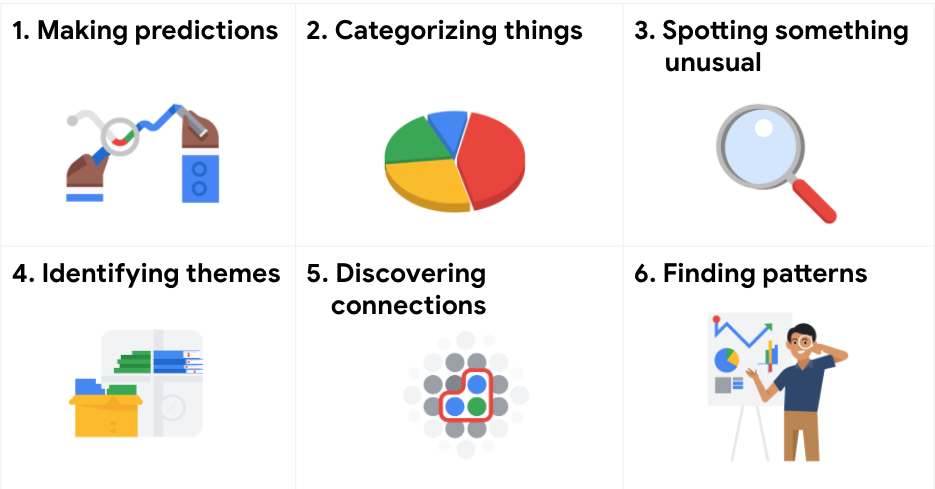
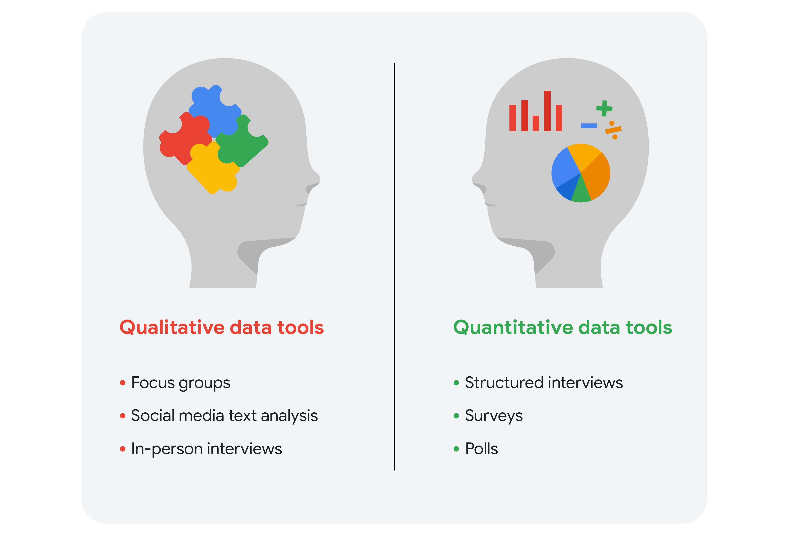

# Course 02 - Ask Questions to Make Data-Driven Decisions

# Module 1: Ask effective questions

### From issue to action: The six data analysis phases
There are six data analysis phases that will help you make seamless decisions: ask, prepare, process, analyze, share, and act. Keep in mind, these are different from the data life cycle, which describes the changes data goes through over its lifetime. Going through the steps will help you solve all kinds of business problems that you might face on the job.

- Step 1: Ask (Decide which questions to ask)

It’s impossible to solve a problem if you don’t know what it is. These are some things to consider:
  - Define the problem you’re trying to solve 
  - Make sure you fully understand the stakeholder’s expectations
  - Focus on the actual problem and avoid any distractions
  - Collaborate with stakeholders and keep an open line of communication
  - Take a step back and see the whole situation in context
  - Questions to ask yourself in this step: 
    - What are my stakeholders saying their problems are?
    - Now that I’ve identified the issues, how can I help the stakeholders resolve their questions?

- Step 2: Prepare (Decide what data you will need in order to answer the questions asked, where to ask and how to store it. This is where the data is collected)

You will decide what data you need to collect in order to answer your questions and how to organize it so that it is useful. You might use your business task to decide: 

- What metrics to measure
- Locate data in your database
- Create security measures to protect that data
- Questions to ask yourself in this step: 
  - What do I need to figure out how to solve this problem?
  - What research do I need to do?

- Step 3: Process (Clean the data retrieved for errors and biases)

Clean data is the best data and you will need to clean up your data to get rid of any possible errors, inaccuracies, or inconsistencies. This might mean:
- Using spreadsheet functions to find incorrectly entered data 
- Using SQL functions to check for extra spaces
- Removing repeated entries
- Checking as much as possible for bias in the data
- Questions to ask yourself in this step: 
  - What data errors or inaccuracies might get in my way of getting the best possible answer to the problem I am trying to solve?
  - How can I clean my data so the information I have is more consistent?

- Step 4: Analyze (Interpret the data to solve the problem at hand)

You will want to think analytically about your data. At this stage, you might sort and format your data to make it easier to: 
- Perform calculations
- Combine data from multiple sources
- Create tables with your results
- Questions to ask yourself in this step:
  - What story is my data telling me?
  - How will my data help me solve this problem?
  - Who needs my company’s product or service? What type of person is most likely to use it?

- Step 5: Share (Create data visualization showing the process and the result)

Everyone shares their results differently so be sure to summarize your results with clear and enticing visuals of your analysis using data via tools like graphs or dashboards. This is your chance to show the stakeholders you have solved their problem and how you got there. Sharing will certainly help your team:  
  - Make better decisions
  - Make more informed decisions
  - Lead to stronger outcomes
  - Successfully communicate your findings
  - Questions to ask yourself in this step:
    - How can I make what I present to the stakeholders engaging and easy to understand?
    - What would help me understand this if I were the listener?

- Step 6: Act

Now it’s time to act on your data. You will take everything you have learned from your data analysis and put it to use. This could mean providing your stakeholders with recommendations based on your findings so they can make data-driven decisions.

- Questions to ask yourself in this step:
  - How can I use the feedback I received during the share phase (step 5) to actually meet the stakeholder’s needs and expectations?

 
 

These six steps can help you to break the data analysis process into smaller, manageable parts, which is called structured thinking. This process involves four basic activities:

Recognizing the current problem or situation

Organizing available information 

Revealing gaps and opportunities

Identifying your options

When you are starting out in your career as a data analyst, it is normal to feel pulled in a few different directions with your role and expectations. Following processes like the ones outlined here and using structured thinking skills can help get you back on track, fill in any gaps and let you know exactly what you need.

### Six common problem types
Data analytics is so much more than just plugging information into a platform to find insights. It is about solving problems. To get to the root of these problems and find practical solutions, there are lots of opportunities for creative thinking. No matter the problem, the first and most important step is understanding it. From there, it is good to take a problem-solver approach to your analysis to help you decide what information needs to be included, how you can transform the data, and how the data will be used. 

Data analysts typically work with six problem types

1. Making predictions 
Using data to make an informed decision about how things may be on the future. A company that wants to know the best advertising method to bring in new customers is an example of a problem requiring analysts to make predictions. Analysts with data on location, type of media, and number of new customers acquired as a result of past ads can't guarantee future results, but they can help predict the best placement of advertising to reach the target audience.

2. Categorizing things 
Assigning information to different groups or clusters based on common features. An example of a problem requiring analysts to categorize things is a company's goal to improve customer satisfaction. Analysts might classify customer service calls based on certain keywords or scores. This could help identify top-performing customer service representatives or help correlate certain actions taken with higher customer satisfaction scores.

3. Spotting something unusual
Identify data that is different from the norm. A company that sells smart watches that help people monitor their health would be interested in designing their software to spot something unusual. Analysts who have analyzed aggregated health data can help product developers determine the right algorithms to spot and set off alarms when certain data doesn't trend normally.

4. Identifying themes 
Takes categorization a step further by grouping information into broader concepts. User experience (UX) designers might rely on analysts to analyze user interaction data. Similar to problems that require analysts to categorize things, usability improvement projects might require analysts to identify themes to help prioritize the right product features for improvement. Themes are most often used to help researchers explore certain aspects of data. In a user study, user beliefs, practices, and needs are examples of themes. 

By now you might be wondering if there is a difference between categorizing things and identifying themes. The best way to think about it is: categorizing things involves assigning items to categories; identifying themes takes those categories a step further by grouping them into broader themes.  

5. Discovering connections 
Enables data analysts to find similar challenges faced by different entities and then combine data and insights to address them. A third-party logistics company working with another company to get shipments delivered to customers on time is a problem requiring analysts to discover connections. By analyzing the wait times at shipping hubs, analysts can determine the appropriate schedule changes to increase the number of on-time deliveries. 

6. Finding patterns
Data analysts use historical data to understand what happened in the past and is therefore likely to happen again. Minimizing downtime caused by machine failure is an example of a problem requiring analysts to find patterns in data. For example, by analyzing maintenance data, they might discover that most failures happen if regular maintenance is delayed by more than a 15-day window. 

## SMART questions
Types of questions to avoid:
- Leading question: leads you to answer in a certain way. Example: "These are the best sandwiches ever, aren't they?"
- Closed-ended question: can be answered with a yes or no. Rarely lead to valuable insights. Example: "Did you enjoy growing up in Malaysia?"
- Vage and lacking context: Example: "Do you prefer chocolate or vanilla?"

Questions shoudld be SMART:
- Specific

Simple, significant and focuesed on a single topic or a few closely related ideas. Is the question specific? Does it address the problem? Does it have context? Will it uncover a lot of the information you need?

- Measurable

Can be quantified and assessed. Will the question give you answers that you can measure? 

- Action-oriented

Encourage change and brings answers we can act on. Will the answers provide information that helps you devise some type of plan?

- Relevant

Matter, are important and have significance for the problem we are trying to solve. Is the question about the particular problem you are trying to solve?

- Time-bound

Specify the time to be studied. Are the answers relevant to the specific time being studied?

Questions should also be <strong>fair</strong>. Fairness means ensuring that your questions don't create or reinforce biases.

### Examples of SMART questions
Here's an example that breaks down the thought process of turning a problem question into one or more SMART questions using the SMART method: <b>What features do people look for when buying a new car? </b>
- Specific: Does the question focus on a particular car feature?
- Measurable: Does the question include a feature rating system?
- Action-oriented: Does the question influence creation of different or new feature packages?
- Relevant: Does the question identify which features make or break a potential car purchase?
- Time-bound: Does the question validate data on the most popular features from the last three years?

Questions should be open-ended. This is the best way to get responses that will help you accurately qualify or disqualify potential solutions to your specific problem. So, based on the thought process, possible SMART questions might be:

- On a scale of 1-10 (with 10 being the most important) how important is your car having four-wheel drive? Explain.
- What are the top five features you would like to see in a car package?
- What features, if included with four-wheel drive, would make you more inclined to buy the car?
- How does a car having four-wheel drive contribute to its value, in your opinion?

### Things to avoid when asking questions
- Leading questions: questions that only have a particular response 

Example: This product is too expensive, isn’t it?

This is a leading question because it suggests an answer as part of the question. A better question might be, “What is your opinion of this product?” There are tons of answers to that question, and they could include information about usability, features, accessories, color, reliability, and popularity, on top of price. Now, if your problem is actually focused on pricing, you could ask a question like “What price (or price range) would make you consider purchasing this product?” This question would provide a lot of different measurable responses.

- Closed-ended questions: questions that ask for a one-word or brief response only

Example: Were you satisfied with the customer trial?

This is a closed-ended question because it doesn’t encourage people to expand on their answer. It is really easy for them to give one-word responses that aren’t very informative. A better question might be, “What did you learn about customer experience from the trial.” This encourages people to provide more detail besides “It went well.”

- Vague questions: questions that aren’t specific or don’t provide context

Example: Does the tool work for you?

This question is too vague because there is no context. Is it about comparing the new tool to the one it replaces? You just don’t know. A better inquiry might be, “When it comes to data entry, is the new tool faster, slower, or about the same as the old tool? If faster, how much time is saved? If slower, how much time is lost?” These questions give context (data entry) and help frame responses that are measurable (time)

## Glossary terms from module 1
Terms and definitions for Course 2, Module 1
Action-oriented question: A question whose answers lead to change 

Cloud: A place to keep data online, rather than a computer hard drive

Data analysis process: The six phases of ask, prepare, process, analyze, share, and act whose purpose is to gain insights that drive informed decision-making

Data life cycle: The sequence of stages that data experiences, which include plan, capture, manage, analyze, archive, and destroy

Leading question: A question that steers people toward a certain response 

Measurable question: A question whose answers can be quantified and assessed

Problem types: The various problems that data analysts encounter, including categorizing things, discovering connections, finding patterns, identifying themes, making predictions, and spotting something unusual

Relevant question: A question that has significance to the problem to be solved

SMART methodology: A tool for determining a question’s effectiveness based on whether it is specific, measurable, action-oriented, relevant, and time-bound 

Specific question: A question that is simple, significant, and focused on a single topic or a few closely related ideas

Structured thinking: The process of recognizing the current problem or situation, organizing available information, revealing gaps and opportunities, and identifying options 

Time-bound question: A question that specifies a timeframe to be studied 

Unfair question: A question that makes assumptions or is difficult to answer honestly 

# Module 2: Make data-driven decisions
Data-inspired decision-making explores different data sources to find out what they have in common.
## Data trials and triumphs
### Data-driven decisions
Data-driven decision-making means using facts to guide business strategy. The phrase “data-driven decisions” means exactly that: Data is used to arrive at a decision. This approach is limited by the quantity and quality of readily-available data. If the quality and quantity of the data is sufficient, this approach can far improve decision-making. But if the data is insufficient or biased, this can create problems for decision-makers. Potential dangers of relying entirely on data-driven decision-making can include overreliance on historical data, a tendency to ignore qualitative insights, and potential biases in data collection and analysis

### Data-inspired decisions
Data-inspired decisions include the same considerations as data-driven decisions while adding another layer of complexity. They create space for people using data to consider a broader range of ideas: drawing on comparisons to related concepts, giving weight to feelings and experiences, and considering other qualities that may be more difficult to measure. Data-inspired decision-making can avoid some of the pitfalls that data-driven decisions might be prone to. 

## Qualitative and quantitative data
### Quantitative data 
Quantitative data is all about the specific and objective measures of numerical facts. This can often be the what, how many, and how often about a problem. In other words, things you can measure, like how many commuters take the train to work every week.
### Qualitative data
Qualitative data describes subjective or explanatory measures of qualities and characteristics or things that can't be measured with numerical data, like your hair color. Qualitative data is great for helping us answer why and how questions. For example, why people might like a certain celebrity or snack food more than others. This is important because it helps us add context to a problem. 

Data analysts will generally use both types of data in their work. Usually, qualitative data can help analysts better understand their quantitative data by providing a reason or more thorough explanation. In other words, quantitative data generally gives you the what, and qualitative data generally gives you the why.dw

## Sharing your findings
### Reports
A report is a static collection of data given to stakeholders periodically. Reports are great for giving snapshots of high level historical data for an organization. For example, a finance firm's monthly sales. They can be designed and sent out periodically, often on a weekly or monthly basis, as organized and easy to reference information. They're quick to design and easy to use as long as you continually maintain them. Finally, because reports use static data or data that doesn't change once it's been recorded, they reflect data that's already been cleaned and sorted.

There are some downsides to keep in mind too. Reports need regular maintenance and aren't very visually appealing. Because they aren't automatic or dynamic, reports don't show live, evolving data.

### Dashboards
A dashboard monitors live, incoming data. They give your team more access to information being recorded, you can interact through data by playing with filters, and because they're dynamic, they have long-term value. If stakeholders need to continually access information, a dashboard can be more efficient than having to pull reports over and over, which is a big time saver for you. Last but not least, they're just nice to look at. 

Dashboards do have some cons too. For one thing, they take a lot of time to design and can actually be less efficient than reports, if they're not used very often. If the base table breaks at any point, they need a lot of maintenance to get back up and running again. Dashboards can sometimes overwhelm people with information too. If you aren't used to looking through data on a dashboard, you might get lost in it. 

### Pivot tables
A pivot table is a data summarization tool that is used in data processing. Pivot tables are used to summarize, sort, re-organize, group, count, total, or average data stored in a database. It allows its users to transform columns into rows and rows into columns. 

## Data versus metrics
A metric is a single, quantifiable type of data that can be used for measurement. Think of it this way. Data starts as a collection of raw facts, until we organize them into individual metrics that represent a single type of data. Metrics usually involve simple math. Revenue, for example, is the number of sales multiplied by the sales price. 

Data contains a lot of raw details about the problem we're exploring. But we need the right metrics to get the answers we're looking for.

## Tools for visualizing data
### Spreadsheets
Both Sheets and Excel are go-to choices for creating static charts and graphs. They offer basic data visualization capabilities that are often enough for simple visualizations. In addition, you can use them to  clean, sort, and filter data. And both offer a range of chart types, graphing tools, and pivot tables for creating effective data visualizations. These charts are easy to manage; they update when the source data is updated, so they don’t require much manual intervention once implemented. 

### Tableau
Tableau is used to create powerful and interactive visualizations, making it an excellent choice for data visualizations such as live dashboards. Tableau also makes it easy to create charts, graphs, and dashboards in a drag-and-drop interface. The application  supports a wide range of data sources and provides advanced analytics capabilities. These features allow for in-depth exploration of data trends and patterns. Tableau is particularly useful for creating visualizations using huge datasets.

| Benefit Type    | For Data Analysts                                      | For Stakeholders                                      |
|-----------------|--------------------------------------------------------|-------------------------------------------------------|
| Centralization  | Share a single source of data with all stakeholders    | Work with a comprehensive view of data, initiatives, objectives, projects, processes, and more |
| Visualization   | Show and update live, incoming data in real time       | Spot changing trends and patterns more quickly        |
| Insightfulness  | Pull relevant information from different datasets      | Understand the story behind the numbers to keep track of goals and make data-driven decisions |
| Customization   | Create custom views dedicated to a specific person, project, or presentation of the data | Drill down to more specific areas of specialized interest or concern |

There are many different visualization tools available. One of the most powerful is Tableau, which supports a range of data sources and has advanced analytics capabilities that allow for in-depth exploration of data trends and patterns. Tableau can handle more data and larger datasets than many other tools and offers real-time data availability. 

## Mathematical thinking
Mathematical thinking means looking at a problem and logically breaking it down step-by-step, so you can see the relationship of patterns in your data, and use that to analyze your problem. This kind of thinking can also help you figure out the best tools for analysis because it lets us see the different aspects of a problem and choose the best logical approach. 

There are a lot of factors to consider when choosing the most helpful tool for your analysis. One way you could decide which tool to use is by the size of your dataset. 

## Big and small data
Whether you work with big or small data, you can use it to help stakeholders improve business processes, answer questions, create new products, and much more. But there are certain challenges and benefits that come with big data and the following table explores the differences between big and small data.

| Small Data                                                                 | Big Data                                                                 |
|---------------------------------------------------------------------------|-------------------------------------------------------------------------|
| Describes a dataset made up of specific metrics over a short, well-defined time period | Describes large, less-specific datasets that cover a long time period    |
| Usually organized and analyzed in spreadsheets                            | Usually kept in a database and queried                                   |
| Likely to be used by small and midsize businesses                         | Likely to be used by large organizations                                 |
| Simple to collect, store, manage, sort, and visually represent            | Takes a lot of effort to collect, store, manage, sort, and visually represent |
| Usually already a manageable size for analysis                            | Usually needs to be broken into smaller pieces in order to be organized and analyzed effectively for decision-making |

### Challenges when working with big data:

- A lot of organizations deal with data overload and way too much unimportant or irrelevant information. 
- Important data can be hidden deep down with all of the non-important data, which makes it harder to find and use. This can lead to slower and more inefficient decision-making time frames.
- The data you need isn’t always easily accessible. 
- Current technology tools and solutions still struggle to provide measurable and reportable data. This can lead to unfair algorithmic bias. 
- There are gaps in many big data business solutions.

### Benefits that come with big data:

- When large amounts of data can be stored and analyzed, it can help companies identify more efficient ways of doing business and save a lot of time and money.
- Big data helps organizations spot the trends of customer buying patterns and satisfaction levels, which can help them create new products and solutions that will make customers happy.
- By analyzing big data, businesses get a much better understanding of current market conditions, which can help them stay ahead of the competition.
- As in our earlier social media example, big data helps companies keep track of their online presence—especially feedback, both good and bad, from customers. This gives them the information they need to improve and protect their brand.

### The three (or four) V words for big data
When thinking about the benefits and challenges of big data, it helps to think about the three Vs: 
- Volume (the amount of data)
- Variety (the different kinds of data)
- Velocity (how fast the data can be processed) 

Some data analysts also consider a fourth V: veracity. Veracity refers to the quality and reliability of the data.

## Glossary terms from module 2
- Algorithm:A process or set of rules followed for a specific task
- Big data:Large,complex datasets typically involving long periods of time,which enable data analysts to address far-reaching business problems
- Dashboard:A tool that monitors live,incoming data
- Data-inspired decision-making:The process of exploring different data sources to find out what they have in common
- Metric:A single,quantifiable type of data that is used for measurement
- Metric goal:A measurable goal set by a company and evaluated using metrics
- Pivot chart:A chart created from the fields in a pivot table
- Pivot table:A data summarization tool used to sort,reorganize,group,count,total,or average data
- Problem types:The various problems that data analysts encounter,including categorizing things,discovering connections,finding patterns,identifying themes,making predictions,and spotting something unusual
- Qualitative data:A subjective and explanatory measure of a quality or characteristic
- Quantitative data:A specific and objective measure,such as a number,quantity,or range
- Report:A static collection of data periodically given to stakeholders
- Return on investment (ROI):A formula that uses the metrics of investment and profit to evaluate the success of an investment
- Revenue:The total amount of income generated by the sale of goods or services
- Small data:Small,specific data points typically involving a short period of time,which are useful for making day-to-day decisions

# Module 3: Spreadsheet magic
## Spreadsheets and the data life cycle
To better understand the benefits of using spreadsheets in data analytics, let’s explore how they relate to each phase of the data life cycle:
- <b>Plan</b> for the users who will work within a spreadsheet by developing organizational standards. This can mean formatting your cells, the headings you choose to highlight, the color scheme, and the way you order your data points. When you take the time to set these standards, you will improve communication, ensure consistency, and help people be more efficient with their time.
- <b>Capture</b> data by the source by connecting spreadsheets to other data sources, such as an online survey application or a database. This data will automatically be updated in the spreadsheet. That way, the information is always as current and accurate as possible.
- <b>Manage</b> different kinds of data with a spreadsheet. This can involve storing, organizing, filtering, and updating information. Spreadsheets also let you decide who can access the data, how the information is shared, and how to keep your data safe and secure. 
- <b>Analyze</b> data in a spreadsheet to help make better decisions. Some of the most common spreadsheet analysis tools include formulas to aggregate data or create reports, and pivot tables for clear, easy-to-understand visuals. 
- <b>Archive</b> any spreadsheet that you don’t use often, but might need to reference later with built-in tools. This is especially useful if you want to store historical data before it gets updated. 
- <b>Destroy</b> your spreadsheet when you are certain that you will never need it again, if you have better backup copies, or for legal or security reasons. Keep in mind, lots of businesses are required to follow certain rules or have measures in place to make sure data is destroyed properly.	

### Absolute referencing
- Absolute referencing is marked by a dollar sign ($). For example, =$A$10 has absolute referencing for both the column and the row value

- Relative references (which is what you normally do, e.g. “=A10”) will change anytime the formula is copied and pasted. They are in relation to where the referenced cell is located. For example if you copied “=A10” to the cell to the right it would become “=B10”. With absolute referencing “=$A$10” copied to the cell to the right would remain “=$A$10”. But if you copied $A10 to the cell below, it would change to $A11 because the row value isn't an absolute reference.

- Absolute references will not change when you copy and paste the formula in a different cell. The cell being referenced is always the same.

- To easily switch between absolute and relative referencing in the formula bar, highlight the reference you want to change and press the F4 key; for example, if you want to change the absolute reference, $A$10, in your formula to a relative reference, A10, highlight $A$10 in the formula bar and then press the F4 key to make the change. 

- In a lot of spreadsheet applications, you can press the F2 (or Enter) key to highlight the range of data in the spreadsheet that is referenced in a formula. Click the cell with the formula, and then press the F2 (or Enter) key to highlight the data in your spreadsheet. 

## Combining with functions
COUNTIF() is a formula and a function. This means the function runs based on criteria set by the formula. In this case, COUNT is the formula; it will be executed IF the conditions you create are true. For example, you could use =COUNTIF(A1:A16, “7”) to count only the cells that contained the number 7. Combining formulas and functions allows you to do more work with a single command. 

IFERROR(formula, message): returns the message if the formula returns an error

DATEDIF(start, end, format): Returns the difference between two dates in a requested format (M, D, Y)

## Save time with structured thinking
### Structured thinking
The process of recognizing the current problem or situation, organizing available information, revealing gaps and opportunities, and identifying the options. In other words, it's a way of being super prepared. It's having a clear list of what you are expected to deliver, a timeline for major tasks and activities, and checkpoints so the team knows you're making progress. 

Structured thinking will help you understand problems at a high level so that you can identify areas that need deeper investigation and understanding. The starting place for structured thinking is the problem domain. Once you know the specific area of analysis, you can set your base and lay out all your requirements and hypotheses before you start investigating. With a solid base in place, you'll be ready to deal with any obstacles that come up.

Another way that you can practice structured thinking and avoid mistakes is by using a scope of work. A scope of work or SOW is an agreed- upon outline of the work you're going to perform on a project. For many businesses, this includes things like work details, schedules, and reports that the client can expect. Now, as a data analyst, your scope of work will be a bit more technical and include those basic items we just mentioned, but you'll also focus on things like data preparation, validation, analysis of quantitative and qualitative datasets, initial results, and maybe even some visuals to really get the point across. 

Let's bring a scope of work to life with a simple example. Say a couple has hired a wedding planner. We'll focus on just one task, the wedding invitations. Here's what might be in scope of work: deliverables, timeline, milestones, and reports. Let's break down just one of these, deliverables. The wedding planner and couple will need to decide on the invitation, make a list of people to invite, collect their addresses, print the invitations, address the envelopes, stamp them, and mail them out. Now let's check out the timelines. You'll notice the dates and the milestones which keep us on track. Finally, we have the reports, which give our couple some peace of mind by telling them when each step is complete.

### Creating a scope of work
Preparing to write an SOW is about asking questions to learn the necessary information about the project, but it’s also about clarifying and defining what you’re being asked to accomplish, and what the limits or boundaries of the “ask” are. 

There’s no standard format for an SOW. They may differ significantly from one organization to another, or from project to project. However, they all have a few foundational pieces of content in common:

Deliverables: 
- <strong>Deliverables: </strong> Items or tasks you will complete before you can finish the project. What work is being done, and what things are being created as a result of this project? When the project is complete, what are you expected to deliver to the stakeholders? Be specific here. Will you collect data for this project? How much, or for how long? 

Avoid vague statements. For example, “fixing traffic problems” doesn’t specify the scope. This could mean anything from filling in a few potholes to building a new overpass. Be specific! Use numbers and aim for hard, measurable goals and objectives. For example: “Identify top 10 issues with traffic patterns within the city limits, and identify the top 3 solutions that are most cost-effective for reducing traffic congestion.”

- <strong>Milestones: </strong> significant tasks you will confirm along your timeline to help everyone know the project is on track. This is closely related to your timeline. What are the major milestones for progress in your project? How do you know when a given part of the project is considered complete?

Milestones can be identified by you, by stakeholders, or by other team members such as the Project Manager. Smaller examples might include incremental steps in a larger project like “Collect and process 50% of required data (100 survey responses)”, but may also be larger examples like ”complete initial data analysis report” or “deliver completed dashboard visualizations and analysis reports to stakeholders”. 

- <strong>Timelines: </strong> include due dates for when deliverables, milestones, and/or reports are due.

Your timeline will be closely tied to the milestones you create for your project. The timeline is a way of mapping expectations for how long each step of the process should take. The timeline should be specific enough to help all involved decide if a project is on schedule. When will the deliverables be completed? How long do you expect the project will take to complete? If all goes as planned, how long do you expect each component of the project will take? When can we expect to reach each milestone?

- <strong>Reports: </strong> notify everyone as you finalize deliverables and meet milestones.

Good SOWs also set boundaries for how and when you’ll give status updates to stakeholders. How will you communicate progress with stakeholders and sponsors, and how often? Will progress be reported weekly? Monthly? When milestones are completed? What information will status reports contain?

At a minimum, any SOW should answer all the relevant questions in the above areas. Note that these areas may differ depending on the project. But at their core, the SOW document should always serve the same purpose by containing information that is specific, relevant, and accurate. If something changes in the project, your SOW should reflect those changes.

SOWs should also contain information specific to what is and isn’t considered part of the project. The scope of your project is everything that you are expected to complete or accomplish, defined to a level of detail that doesn’t leave any ambiguity or confusion about whether a given task or item is part of the project or not. 

Notice how the previous example about studying traffic congestion defined its scope as the area within the city limits. This doesn’t leave any room for confusion — stakeholders need only to refer to a map to tell if a stretch of road or intersection is part of the project or not.  Defining requirements can be trickier than it sounds, so it’s important to be as specific as possible in these documents, and to use quantitative statements whenever possible. 

For example, assume that you’re assigned to a project that involves studying the environmental effects of climate change on the coastline of a city: How do you define what parts of the coastline you are responsible for studying, and which parts you are not?

In this case, it would be important to define the area you’re expected to study using GPS locations, or landmarks. Using specific, quantifiable statements will help ensure that everyone has a clear understanding of what’s expected. 

### Contextualizing data
- Context: the condition in which something exists or happens

Context in data analytics is the condition and circumstances that surround and give meaning to the data. Context is important in data analytics because it helps make disorganized data accessible and understood. The fact is, data has little value if it is not paired with context. 

Context can turn raw data into meaningful information. It is very important for data analysts to contextualize their data. This means giving the data perspective by defining it. To do this, you need to identify:

- Who: The person or organization that created, collected, and/or funded the data collection
- What: The things in the world that data could have an impact on
- Where: The origin of the data
- When: The time when the data was created or collected
- Why: The motivation behind the creation or collection
- How: The method used to create or collect it

## Glossary terms from module 3
- AVERAGE: A spreadsheet function that returns an average of the values from a selected range 
- Borders: Lines that can be added around two or more cells on a spreadsheet
- Cell reference: A cell or a range of cells in a worksheet typically used in formulas and functions
- COUNT: A spreadsheet function that counts the number of cells in a range that meet a specific criteria
- Equation: A calculation that involves addition, subtraction, multiplication, or division (also called a math expression)
- Fill handle: A box in the lower-right-hand corner of a selected spreadsheet cell that can be dragged through neighboring cells in order to continue an instruction
- Filtering: The process of showing only the data that meets a specified criteria while hiding the rest
- Header: The first row in a spreadsheet that labels the type of data in each column
- Math expression: A calculation that involves addition, subtraction, multiplication, or division (also called an equation)
- Math function: A function that is used as part of a mathematical formula
- MAX: A spreadsheet function that returns the largest numeric value from a range of cells
- MIN: A spreadsheet function that returns the smallest numeric value from a range of cells
- Open data: Data that is available to the public
- Operator: A symbol that names the operation or calculation to be performed
- Order of operations: Using parentheses to group together spreadsheet values in order to clarify the order in which operations should be performed
- Problem domain: The area of analysis that encompasses every activity affecting or affected by a problem
- Range: A collection of two or more cells in a spreadsheet
- Report: A static collection of data periodically given to stakeholders 
- Return on investment (ROI): A formula that uses the metrics of investment and profit to evaluate the success of an investment
- Revenue: The total amount of income generated by the sale of goods or services 
- Scope of work (SOW): An agreed-upon outline of the tasks to be performed during a project
- Sorting: The process of arranging data into a meaningful order to make it easier to understand, analyze, and visualize
- SUM: A spreadsheet function that adds the values of a selected range of cells

# Module 4: Always remember the stakeholder
Stakeholders: people that have invested time, interest, and resources into the projects that you'll be working on as a data analyst. In other words, they hold stakes in what you're doing. 

## Working with stakeholders
Your data analysis project should answer the business task and create opportunities for data-driven decision-making. That's why it is so important to focus on project stakeholders. As a data analyst, it is your responsibility to understand and manage your stakeholders’ expectations while keeping the project goals front and center.

Your project stakeholders may change from project to project, but there are three common stakeholder groups that you might find yourself working with: the executive team, the customer-facing team, and the data science team.

- Executive team: The executive team provides strategic and operational leadership to the company. They set goals, develop strategy, and make sure that strategy is executed effectively. The executive team might include vice presidents, the chief marketing officer, and senior-level professionals who help plan and direct the company’s work. These stakeholders think about decisions at a very high level and they are looking for the headline news about your project first.  They are less interested in the details. 

- Customer-facing team: The customer-facing team includes anyone in an organization who has some level of interaction with customers and potential customers. Typically they compile information, set expectations, and communicate customer feedback to other parts of the internal organization. These stakeholders have their own objectives and may come to you with specific asks. It is important to let the data tell the story and not be swayed by asks from your stakeholders to find certain patterns that might not exist. 

- Data science team: Organizing data within a company takes teamwork. There's a good chance you'll find yourself working with other data analysts, data scientists, and data engineers. For example, maybe you team up with a company's data science team to work on boosting company engagement to lower rates of employee turnover. In that case, you might look into the data on employee productivity, while another analyst looks at hiring data. Then you share those findings with the data scientist on your team, who uses them to predict how new processes could boost employee productivity and engagement. When you share what you found in your individual analyses, you uncover the bigger story. A big part of your job will be collaborating with other data team members to find new angles of the data to explore.

## Working effectively with stakeholders
When you're working with each group of stakeholders- from the executive team, to the customer-facing team, to the data science team, you'll often have to go beyond the data. Use the following tips to communicate clearly, establish trust, and deliver your findings across groups.

- Discuss goals. Stakeholder requests are often tied to a bigger project or goal. When they ask you for something, take the opportunity to learn more. Start a discussion. Ask about the kind of results the stakeholder wants. Sometimes, a quick chat about goals can help set expectations and plan the next steps.

- Feel empowered to say “no.” Let’s say you are approached by a marketing director who has a “high-priority” project and needs data to back up their hypothesis. They ask you to produce the analysis and charts for a presentation by tomorrow morning. Maybe you realize their hypothesis isn’t fully formed and you have helpful ideas about a better way to approach the analysis. Or maybe you realize it will take more time and effort to perform the analysis than estimated. Whatever the case may be, don’t be afraid to push back when you need to. 

## Use multiple communication strategies to reach your audience
Being able to communicate in multiple formats is a key skill for data analysts. Listening, speaking, presenting, and writing skills will help you succeed in your projects and in your career. Here's an important first tip: Know your audience! When you communicate your analysis and recommendations as a data analyst, it's vital to keep your audience in mind. 

Be sure to answer these four important questions related to your audience:

- Who is your audience? 
- What do they already know? 
- What do they need to know? 
- How can you best communicate what they need to know? 

## Limitations of data
### The case of incomplete (or nonexistent!) data
If you have incomplete or nonexistent data, you might realize during an analysis that you don't have enough data to reach a conclusion. Or, you might even be solving a different problem altogether! For example, suppose you are looking for employees who earned a particular certificate but discover that certification records go back only two years at your company. You can still use the data, but you will need to make the limits of your analysis clear. You might be able to find an alternate source of the data by contacting the company that led the training. But to be safe, you should be up front about the incomplete dataset until that data becomes available.

### Don't miss misaligned data
If you're collecting data from other teams and using existing spreadsheets, it is good to keep in mind that people use different business rules. So one team might define and measure things in a completely different way than another. For example, if a metric is the total number of trainees in a certificate program, you could have one team that counts every person who registered for the training, and another team that counts only the people who completed the program. In cases like these, establishing how to measure things early on standardizes the data across the board for greater reliability and accuracy. This will make sure comparisons between teams are meaningful and insightful.

### Deal with dirty data
Dirty data refers to data that contains errors. Dirty data can lead to productivity loss, unnecessary spending, and unwise decision-making. A good data cleaning effort can help you avoid this. As a quick reminder, data cleaning is the process of fixing or removing incorrect, corrupted, incorrectly formatted, duplicate, or incomplete data within a dataset. When you find and fix the errors - while tracking the changes you made - you can avoid a data disaster. 

### Tell a clear story
- Compare the same types of data: Data can get mixed up when you chart it for visualization. Be sure to compare the same types of data and double check that any segments in your chart definitely display different metrics. 
- Visualize with care: A 0.01% drop in a score can look huge if you zoom in close enough. To make sure your audience sees the full story clearly, it is a good idea to set your Y-axis to 0.
- Leave out needless graphs: If a table can show your story at a glance, stick with the table instead of a pie chart or a graph. Your busy audience will appreciate the clarity.
- Test for statistical significance: Sometimes two datasets will look different, but you will need a way to test whether the difference is real and important. So remember to run statistical tests to see how much confidence you can place in that difference.
- Pay attention to sample size: Gather lots of data. If a sample size is small, a few unusual responses can skew the results. If you find that you have too little data, be careful about using it to form judgments. Look for opportunities to collect more data, then chart those trends over longer periods.

### Be the judge
In any organization, a big part of a data analyst’s role is making sound judgments. When you know the limitations of your data, you can make judgment calls that help people make better decisions supported by the data. Data is an extremely powerful tool for decision-making, but if it is incomplete, misaligned, or hasn’t been cleaned, then it can be misleading. Take the necessary steps to make sure that your data is complete and consistent. Clean the data before you begin your analysis to save yourself and possibly others a great amount of time and effort.

Free data sources: 
- World Bank 
- World Health Organization
- Google Public Data Explorer
- U.S. Census Bureau