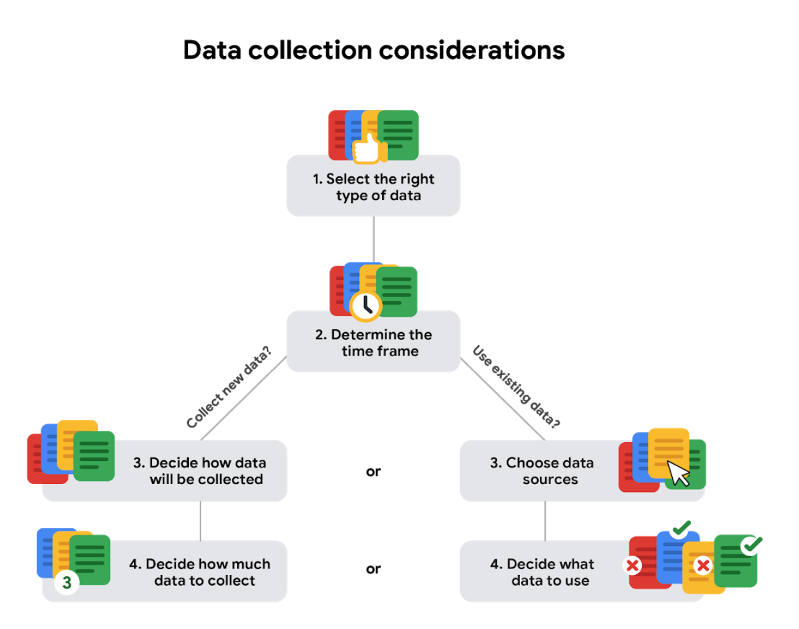
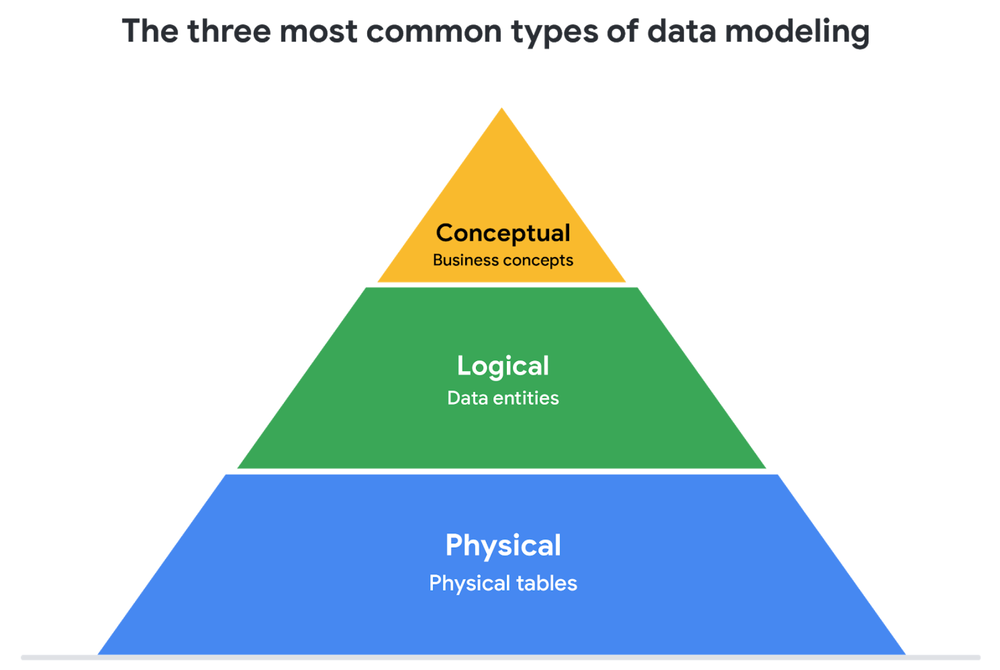
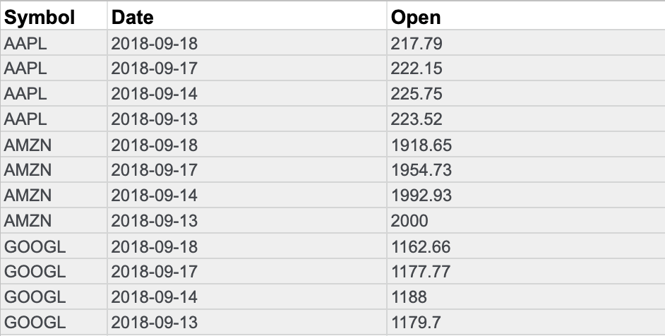
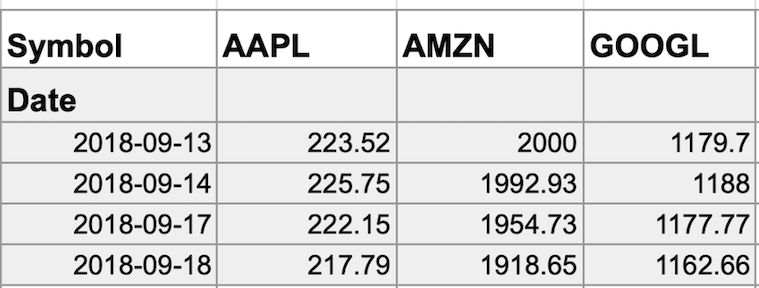

# Course 03 - Prepare Data For Exploration
# Module 1
## Data exploration
### Data collection considerations
- How the data will be colected
  Decide if you will collect the data using your own resources or receive (and possibly purchase it) from another party. Data that you collect yourself is called first-party data.
- Data sources
  - First-party data: data collected by an individual or group using their own resources. Tipically the preferred method because you know exactly where it came from.
  - Second-party data: data collected by a group directly from its audience and then sold. his data didn't start with you, but it's still reliable because it came from a source that has experience with traffic analysis.
  - Third-party data: data collected from outside sources who did not collect it directly. This data might have come from a number of different sources before you investigated it. It might not be as reliable, but that doesn't mean it can't be useful. You'll just want to make sure you check it for accuracy, bias, and credibility. 
- Decide what data to use
  Datasets can show a lot of interesting information. But be sure to choose data that can actually help solve your problem question. For example, if you are analyzing trends over time, make sure you use time series data — in other words, data that includes dates.
- How much data to collect
  - Population: all possible data values in a dataset. If you're analyzing data about car traffic in a city, your population would be all the cars in that area. But collecting data from the entire population can be pretty challenging. That's why a sample can be useful. 
  - Sample: part of a population that is representative of the population. You might collect a data sample about one spot in the city and analyze the traffic there, or you might pull a random sample from all existing data in the population. How you choose your sample will depend on your project. 

  If you are collecting your own data, make reasonable decisions about sample size. A random sample from existing data might be fine for some projects. Other projects might need more strategic data collection to focus on certain criteria. Each project has its own needs. 
- Select the right data type

- Determine the time frame for data collection
  If you are collecting your own data, decide how long you will need to collect it, especially if you are tracking trends over a long period of time. If you need an immediate answer, you might not have time to collect new data. In this case, you would need to use historical data that already exists. 

  

### Data formats
- Quantitative data:
  - Discrete data: data that is counted and has a limited number of values. Example is a movie's budget and box office. They can be counted and have a limited number of values. For example, the amount of money a movie makes can only be represented with exactly two digits after the decimal to represent cents. There can't be anything between one and two cents. Discrete data isn't limited to dollar amounts. Examples of other discrete data are stars and points. When partial measurements (half-stars or quarter-points) aren't allowed, the data is discrete. If you don't accept anything other than full stars or points, the data is considered discrete.
  - Continuous data: data that can be measured using a timer, and its value can be shown as a decimal with several places. Examples are movie run time (110.0563 minutes)
- Qualitative data:
  - Nominal data: a type of qualitative data that's categorized without a set order. In other words, this data doesn't have a sequence. Examples are questions like "Have you watched Star Wars?". Answers could be "Yes", "No", "Not sure". These choices don't have a particular order.
  - Ordinal data: a type of qualitative data with a set order or scale. If you asked a group of people to rank a movie from 1 to 5, some might rank it as a 2, others a 4, and so on. These rankings are in order of how much each person liked the movie.
- Internal data: data that lives within a company's own systems. For example, if a movie studio had compiled all of the data in the spreadsheet using only their own collection methods, then it would be their internal data
- External data: data that lives and is generated outside of an organization. External data becomes particularly valuable when your analysis depends on as many sources as possible. A great thing about this data is that it's structured.
- Structured data: data that's organized in a certain format, such as rows and columns. Spreadsheets and relational databases are two examples of software that can store data in a structured way. 
- Unstructured data: data that is not organized in any easily identifiable manner. Audio and video files are examples of unstructured data because there's no clear way to identify or organize their content. Unstructured data might have internal structure, but the data doesn't fit neatly in rows and columns like structured data.

### Primary versus secondary data
| Data format classification | Definition                                      | Examples                                                    |
|---------------------------|-------------------------------------------------|-------------------------------------------------------------|
| Primary data              | Collected by a researcher from first-hand sources | Data from an interview you conducted - Data from a survey returned from 20 participants - Data from questionnaires you got back from a group of workers |
| Secondary data            | Gathered by other people or from other research  | Data you bought from a local data analytics firm’s customer profiles - Demographic data collected by a university - Census data gathered by the federal government |

### Internal versus external data
| Data format classification | Definition                                      | Examples                                                    |
|---------------------------|-------------------------------------------------|-------------------------------------------------------------|
| Internal data              | Data that is stored inside a company’s own systems | Wages of employees across different business units tracked by HR - Sales data by store location - Product inventory levels across distribution centers |
| External data            | Data that is stored outside of a company or organization  | National average wages for the various positions throughout your organization - Credit reports for customers of an auto dealership |

### Continuous versus discrete data
| Data format classification | Definition                                      | Examples                                                    |
|---------------------------|-------------------------------------------------|-------------------------------------------------------------|
| Continuous data           | Data that is measured and can have almost any numeric value | Height of kids in third grade classes (52.5 inches, 65.7 inches), Runtime markers in a video, Temperature |
| Discrete data             | Data that is counted and has a limited number of values | Number of people who visit a hospital on a daily basis (10, 20, 200), Maximum capacity allowed in a room, Tickets sold in the current month |

### Qualitative versus quantitative data
| Data format classification | Definition                                      | Examples                                                    |
|---------------------------|-------------------------------------------------|-------------------------------------------------------------|
| Qualitative               | A subjective and explanatory measure of a quality or characteristic | Favorite exercise activity - Brand with best customer service - Fashion preferences of young adults |
| Quantitative              | A specific and objective measure, such as a number, quantity, or range | Percentage of board certified doctors who are women - Population size of elephants in Africa - Distance from Earth to Mars at a particular time |

### Nominal versus ordinal data
| Data format classification | Definition                                      | Examples                                                    |
|---------------------------|-------------------------------------------------|-------------------------------------------------------------|
| Nominal                   | A type of qualitative data that is categorized without a set order | First time customer, returning customer, regular customer - New job applicant, existing applicant, internal applicant - New listing, reduced price listing, foreclosure |
| Ordinal                   | A type of qualitative data with a set order or scale | Movie ratings (number of stars: 1 star, 2 stars, 3 stars) - Ranked-choice voting selections (1st, 2nd, 3rd) - Satisfaction level measured in a survey (satisfied, neutral, dissatisfied) |

### Structured versus unstructured data
| Data format classification | Definition                                      | Examples                                                    |
|---------------------------|-------------------------------------------------|-------------------------------------------------------------|
| Structured data           | Data organized in a certain format, like rows and columns | Expense reports, Tax returns, Store inventory |
| Unstructured data         | Data that cannot be stored as columns and rows in a relational database | Social media posts, Emails, Videos |

Structured data works nicely within a <strong>data model</strong>, which is a model that is used for organizing data elements and how they relate to one another. <strong>Data elements</strong> are pieces of information, such as people's names, account numbers, and addresses. Data models help to keep data consistent and provide a map of how data is organized. 

### The effects of different structures
Data is everywhere and it can be stored in lots of ways. Two general categories of data are: 
- Structured data: Organized in a certain format, such as rows and columns.
- Unstructured data: Not organized in any easy-to-identify way.
For example, when you rate your favorite restaurant online, you're creating structured data. But when you use Google Earth to check out a satellite image of a restaurant location, you're using unstructured data. 

### The fairness issue

The lack of structure makes unstructured data difficult to search, manage, and analyze. But recent advancements in artificial intelligence and machine learning algorithms are beginning to change that. Now, the new challenge facing data scientists is making sure these tools are inclusive and unbiased. Otherwise, certain elements of a dataset will be more heavily weighted and/or represented than others. And as you're learning, an unfair dataset does not accurately represent the population, causing skewed outcomes, low accuracy levels, and unreliable analysis.

## Data modeling levels and techniques
This reading introduces you to data modeling and different types of data models. Data models help keep data consistent and enable people to map out how data is organized.
### What is data modeling?
Data modeling is the process of creating diagrams that visually represent how data is organized and structured.  These visual representations are called data models. You can think of data modeling as a blueprint of a house. At any point, there might be electricians, carpenters, and plumbers using that blueprint. Each one of these builders has a different relationship to the blueprint, but they all need it to understand the overall structure of the house. Data models are similar; different users might have different data needs, but the data model gives them an understanding of the structure as a whole. 

### Levels of data modeling

Each level of data modeling has a different level of detail. 

- Conceptual data modeling gives a high-level view of the data structure, such as how data interacts across an organization. For example, a conceptual data model may be used to define the business requirements for a new database. A conceptual data model doesn't contain technical details. 
- Logical data modeling focuses on the technical details of a database such as relationships, attributes, and entities. For example, a logical data model defines how individual records are uniquely identified in a database. But it doesn't spell out actual names of database tables. That's the job of a physical data model.
- Physical data modeling depicts how a database operates. A physical data model defines all entities and attributes used; for example, it includes table names, column names, and data types for the database.

### Data-modeling techniques

There are a lot of approaches when it comes to developing data models, but two common methods are the Entity Relationship Diagram (ERD) and the Unified Modeling Language (UML) diagram. ERDs are a visual way to understand the relationship between entities in the data model. UML diagrams are very detailed diagrams that describe the structure of a system by showing the system's entities, attributes, operations, and their relationships. As a junior data analyst, you will need to understand that there are different data modeling techniques, but in practice, you will probably be using your organization’s existing technique. 

### Data analysis and data modeling

Data modeling can help you explore the high-level details of your data and how it is related across the organization’s information systems. Data modeling sometimes requires data analysis to understand how the data is put together; that way, you know how to map the data. And finally, data models make it easier for everyone in your organization to understand and collaborate with you on your data. 

## Explore data types, fields and values
### Data type

A specific kind of data attribute that tells what kind of value the data is. In other words, a data type tells you what kind of data you're working with. Data types can be different depending on the query language you're using. For example, SQL allows for different data types depending on which database you're using. A data type in a spreadsheet can be one of three things: a number, a text or string, or a Boolean.

## Wide and long data
- With wide data, every data subject has a single row with multiple columns to hold the values of various attributes of the subject. In a wide format, data is spread across columns, with each observation in a single row. This is common for cross-sectional analysis.

| ID | Name  | Score_2023 | Score_2024 | Score_2025 |
|----|-------|------------|------------|------------|
| 1  | Alice | 85         | 90         | 88         |
| 2  | Bob   | 78         | 82         | 85         |
| 3  | Carol | 92         | 94         | 91         |

Key characteristics:
  1. Each year (2023, 2024, 2025) is in a separate column.
  1. Fewer rows, more columns.
  1. Easier for reading but harder for some types of analysis.

- Long data is data in which each row is one time point per subject, so each subject will have data in multiple rows. In a long format, data is stacked with repeated observations across rows for different time points.

| ID | Name  | Year | Score |
|----|-------|------|-------|
| 1  | Alice | 2023 | 85    |
| 1  | Alice | 2024 | 90    |
| 1  | Alice | 2025 | 88    |
| 2  | Bob   | 2023 | 78    |
| 2  | Bob   | 2024 | 82    |
| 2  | Bob   | 2025 | 85    |
| 3  | Carol | 2023 | 92    |
| 3  | Carol | 2024 | 94    |
| 3  | Carol | 2025 | 91    |

Key characteristics:

1. Each year appears as a separate row.
1. More rows, fewer columns.
1. Easier for statistical analysis and visualization (e.g., time-series analysis).

## Transforming data
Data transformation is the process of changing the data’s format, structure, or values. Data transformation usually involves:

- Adding, copying, or replicating data 
- Deleting fields or records 
- Standardizing the names of variables
- Renaming, moving, or combining columns in a database
- Joining one set of data with another
- Saving a file in a different format. For example, saving a spreadsheet as a comma separated values (.csv) file.

### Why transform data?
Goals for data transformation might be: 

- Data organization: better organized data is easier to use
- Data compatibility: different applications or systems can then use the same data
- Data migration: data with matching formats can be moved from one system to another
- Data merging: data with the same organization can be merged together
- Data enhancement: data can be displayed with more detailed fields 
- Data comparison: apples-to-apples comparisons of the data can then be made 

### Data transformation example: data merging
Mario is a plumber who owns a plumbing company. After years in the business, he buys another plumbing company. Mario wants to merge the customer information from his newly acquired company with his own, but the other company uses a different database. So, Mario needs to make the data compatible. To do this, he has to transform the format of the acquired company’s data. Then, he must remove duplicate rows for customers they had in common.

### Data transformation example: data organization (long to wide)
To make it easier to create charts, you may also need to transform long data to wide data. Consider the following example of transforming stock prices (collected as long data) to wide data. 

Long data is data where each row contains a single data point for a particular item. In the long data example below, individual stock prices (data points) have been collected for Apple (AAPL), Amazon (AMZN), and Google (GOOGL) (particular items) on the given dates.

Wide data is data where each row contains multiple data points for the particular items identified in the columns. 

With data transformed to wide data, you can create a chart comparing how each company's stock changed over the same period of time.  

You might notice that all the data included in the long format is also in the wide format. But wide data is easier to read and understand. That is why data analysts typically transform long data to wide data more often than they transform wide data to long data. The following table summarizes when each format is preferred:

| Wide data is preferred when  | Long data is preferred when |
| ---------------------------- | --------------------------- |
| Creating tables and charts with a few variables about each subject | Storing a lot of variables about each subject. For example, 60 years worth of interest rates for each bank |
| Comparing straightforward line graphs | Performing advanced statistical analysis or graphing |

## Terms and definitions for Course 3, Module 1
Agenda: A list of scheduled appointments

Audio file: Digitized audio storage usually in an MP3, AAC, or other compressed format

Boolean data: A data type with only two possible values, usually true or false

Continuous data: Data that is measured and can have almost any numeric value

Cookie: A small file stored on a computer that contains information about its users

Data element: A piece of information in a dataset 

Data model: A tool for organizing data elements and how they relate to one another

Digital photo: An electronic or computer-based image usually in BMP or JPG format

Discrete data: Data that is counted and has a limited number of values

External data: Data that lives, and is generated, outside of an organization

Field: A single piece of information from a row or column of a spreadsheet; in a data table, typically a column in the table

First-party data: Data collected by an individual or group using their own resources

Long data: A dataset in which each row is one time point per subject, so each subject has data in multiple rows

Nominal data: A type of qualitative data that is categorized without a set order

Ordinal data: Qualitative data with a set order or scale

Ownership: The aspect of data ethics that presumes individuals own the raw data they provide and have primary control over its usage, processing, and sharing 

Pixel: In digital imaging, a small area of illumination on a display screen that, when combined with other adjacent areas, forms a digital image 

Population: In data analytics, all possible data values in a dataset

Record: A collection of related data in a data table, usually synonymous with row

Sample: In data analytics, a segment of a population that is representative of the entire population

Second-party data: Data collected by a group directly from its audience and then sold 

Social media: Websites and applications through which users create and share content or participate in social networking

String data type: A sequence of characters and punctuation that contains textual information (Refer to Text data type)

Structured data: Data organized in a certain format such as rows and columns

Text data type: A sequence of characters and punctuation that contains textual information (also called string data type)

United States Census Bureau: An agency in the U.S. Department of Commerce that serves as the nation’s leading provider of quality data about its people and economy

Unstructured data: Data that is not organized in any easily identifiable manner

Video file: A collection of images, audio files, and other data usually encoded in a compressed format such as MP4, MV4, MOV, AVI, or FLV

Wide data: A dataset in which every data subject has a single row with multiple columns to hold the values of various attributes of the subject

# Module 2 - Unbiased and objective data
